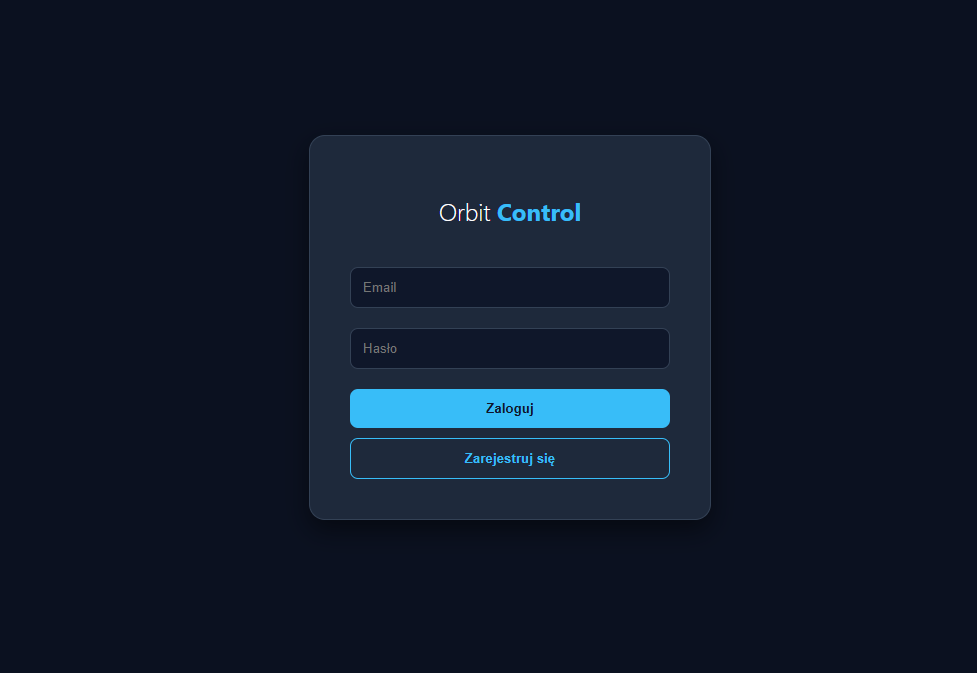
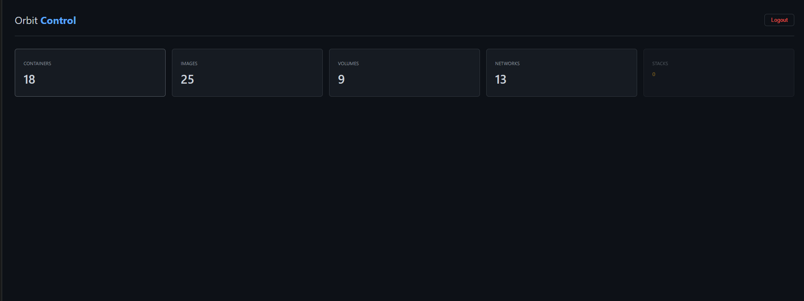

<div align="center">

#  Orbit Control

### Simple & Beautiful Docker Management Panel


**Monitor and manage your Docker containers, images, volumes, and networks from a beautiful web interface.**

[Features](#-features) • [Installation](#-installation) • [Usage](#-usage) • [Roadmap](#-roadmap)

</div>


---

##  Features

| Feature | Status |
|---------|--------|
|  **Container Management** |  Start, Stop, Restart, Remove |
|  **Image Management** |  Pull, Remove |
|  **Volume Management** |  Create, Remove |
|  **Network Management** |  Create, Remove |
|  **User Authentication** |  Login, Register |
|  **Real-time Stats** |  Auto-refresh every 5s |
|  **Update Notifications** |  GitHub release checker |
|  **Stack Management** |  Coming Soon |
|  **Multi-host Support** |  Coming Soon |

---

##  Installation

### Docker (Recommended)

```bash
docker run -d \
  --name orbit \
  --user root \
  -p 5001:5000 \
  -v /var/run/docker.sock:/var/run/docker.sock \
  -v orbit-data:/app/data \
  --restart unless-stopped \
  tobimessi2010/orbit-control:v4
```

### Docker Compose

```yaml
version: '3.8'

services:
  orbit:
    image: tobimessi2010/orbit-control:v4
    container_name: orbit
    user: root
    ports:
      - "5001:5000"
    volumes:
      - /var/run/docker.sock:/var/run/docker.sock
      - orbit-data:/app/data
    restart: unless-stopped

volumes:
  orbit-data:
```

```bash
docker-compose up -d
```

---

##  Usage

1. Open **http://localhost:5001** in your browser
2. **Register** a new account
3. **Login** and start managing your Docker environment! 🎉

### Default Port: `5001`

---

## Screenshots

<div align="center">
<details>
<summary>Click to expand</summary>

<br>

### Login Page


<br>

### Dashboard


</details>
</div>

</details>

---

##  Roadmap

- [x] Container CRUD operations
- [x] Image management
- [x] Volume management
- [x] Network management
- [x] User authentication
- [x] Update checker
- [ ] Stack/Compose management
- [ ] Multi-host support
- [ ] Container logs viewer
- [ ] Container exec terminal
- [ ] Resource usage graphs
- [ ] Discord/Telegram notifications

---

##  Tech Stack

- **Backend:** Python 3.11, Flask
- **Frontend:** Vanilla JS, CSS
- **Database:** SQLite
- **Container:** Docker

---

##  Contributing

Contributions are welcome! Feel free to:

1. Fork the repository
2. Create a feature branch (`git checkout -b feature/amazing-feature`)
3. Commit your changes (`git commit -m 'Add amazing feature'`)
4. Push to the branch (`git push origin feature/amazing-feature`)
5. Open a Pull Request

---

##  License

This project is licensed under the MIT License - see the [LICENSE](LICENSE) file for details.

---

##  Star History

If you find this project useful, please consider giving it a star! 

---

<div align="center">

**Made with ❤️ by [TobiMessi](https://github.com/TobiMessi)**

</div>
